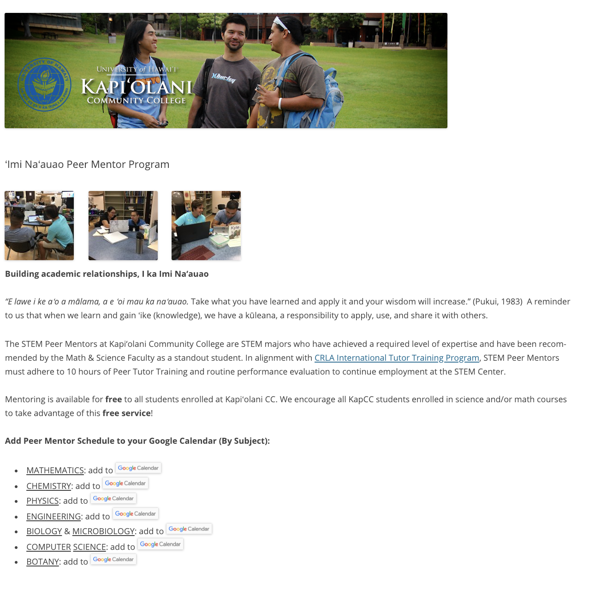
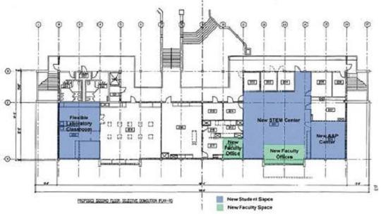

All students at Kapiolani Community College(KCC) enrolled in any Stem (Science, Technology, Engineering, and Math) classes are able to take advantage of the free tutoring services in the Stem center at KCC. The Stem center at KCC is located in the Koki‘o building room 202, and it houses the offices to a few stem professors. To access the services of the Stem center students are asked to sign into a computer at the door on the left of the entrance. From there students are encouraged to locate a tutor, with prominent name cards faceing the door, and introduce themselves with a specific question that the tutor can help them solve. 

You can learn more about the KCC stem center at the [KCC Stem Center Home Page](http://stem.kapiolani.hawaii.edu/the-stem-center/). And look for the "'Imi Na'auao Peer Mentor Program" under the students tab for a full schedule of the tutors available at KCC.

For this project, I was asked to help fill in for previous tutors who had left since the stem center was having issues recruiting new peer mentors at the time. I worked as an ICS tutor during the semester of Spring 2018 tutoring students in ICS 111 and ICS 211. In that time I learned a few things when interacting with other students as a tutor, complete patience since everyone learns differently, and how to help a student without doing their work for them. The tasks and responibilities of a tutor were simple, use my knoweledge and experience from previous classes to help a student solve their current problem and potentially teach them a different way of looking at the issue to better understand it. By the end of the semester I had helped a small handfull of students, and learned how to properly outline, walkthrough, and or explain the problem presented to me without comnpleteing their assignment for them.

I would like to also highlight two types of experiences I would see when interacting with students as a tutor. The first type was when meeting a student who had a specific problem, they had gone through their own process in fixing it and now wanted a different set of eyes to help them work on it. These interactions took anywhere from 30 minutes to maybe an hour, since the student knew what they were doing the most I would contribute was patience, confidence, and the occasional gesture in the right direction. The other type of experience was when meeting with a student who had a broad problem, I was warned of students that might procastinate to the last second and use this resource as a way out. These interactions would take anywhere between 30 minutes to 3 hours with three basic questions, "I don't know where to start", "I don't understand", and "Could you show me how to do it?", all of which were heavyly implied to get the tutor to either write a bulk of code or all of it. To be brutally honest I fell for these tactics the first time but caught myself half way through while helping the student, nonetheless it was a learning experience. I did eventually find that students who actually didn't understand the topic, but kept up in class, usually only needed an outline or walkthrough to boost their confindence when attempting the work. But those students who neglected both the class and their studies would just keep asking the same questions until either the tutor caved out of frustration or they left because the tutor didn't. All the ICS tutors learned and communicated to each other about these types of behaviours early on before anyone exploited that resource to any extreme in this way. Near the end of the semester we also saw a few of the students, who originally neglected their class, realize we weren't there to give out free answers and instead took the class more seriously and would come in for help with more specific issues as the semester went on. 
