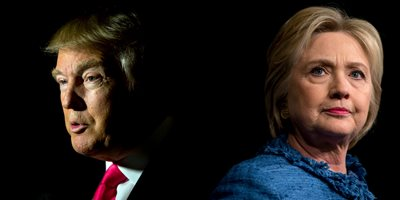

  

As a computer science student programing is a large interest of mine, but as of recent the political debate has started to also peek my interest. During the last political election between the now elected Trump and his opponent Hillary Clinton, I quickly recognized that the political scene can be easily manipulated and that a large portion of people don’t know what where to find reliable information. I came to this realization when I had two different friends, supporting the two opposite candidates who would support and counter each others claims from multiple different news sources. Which brings me to why I want to make a language recognition software that identifies political agendas. 

During my first semester in college I tried to keep up with such a large political election. I realized that as time went on in the election people started voting based off of political party and not on actual reasoning. I want to make this an issue, political parties flood individuals with information in hope that those who don’t follow will vote based off of the party they beleive represents them. In my case I started to do the same, I voted off of the party based on family views. I want to start this project to make the next political election and possibly all political elections, Presidential to even state Governor elections easier to follow by using software to find credible sites with true political neutrality to read and summerize it for the general public. This idea later on could possibly include videos or strict data to look at when making a political decision or claims. 
